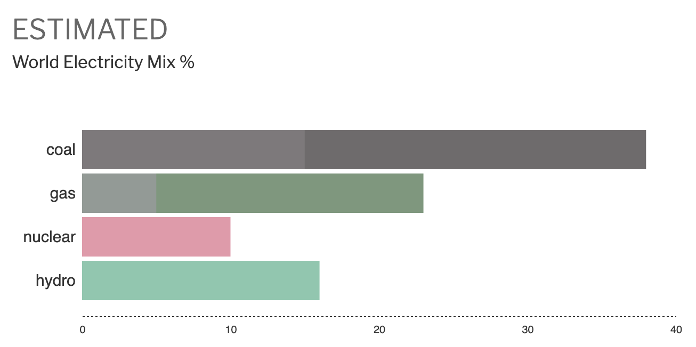

# Bar Chart Block (dev)

A dataviz block for creating simple bar charts with either stacked bars or +ve/-ve split at origin/0.

|Stacked|
|:---|
||

|Split at origin|
|:---|
||

## Modes & Options

There are two modes when working with the block: live preview mode and block mode. These are outlined below.

### Live Preview Mode

|Preview Mode Options|
|:---|
||

In preview mode, the chart is not selected and the rendered/visible chart is shown in the editor. This is the same chart that will be shown on the frontend. The sidebar includes various options/settings that can be adjusted to customize the chart. The visible chart is a live preview that gets updated dynamically as you modify options.

There are options to switch between "stacked" and "split at origin" views, change the thickness of the bars, inner padding, bar colors across the whole chart, width of the labels, toggle the bottom/side axes, switch between vertical/horizontal views (up next), and more options to follow (add lagends, backgrounds, overlays, raw data input, etc).

### Block Mode

|Block Mode Options|
|:---|
||

When the chart is selected, the underlying blocks become visible instead. These represent the actual bars that are rendered in the chart. They can be re-ordered as normal blocks. With a block selected, you may modify per-bar descriptions and colors from the sidebar.

## Up Next

### Known Issues

- Colors go back to global defaults when editing a saved post or reusing/duplicating an existing chart in editor.
- Rethink how bars/canvas interact - introduce a store instead.
- Rethink how chart data is passed to the frontend.
- Units in axis.

### Additions

- Include live-preview when modifying individual bars.
- Vertical and horizontal charts.
- More options to customize the chart, add legends, custom bar edges, overlays, backgrounds, ability to insert raw data, focus points, etc.
- A new block-appender to insert bars automatically.
